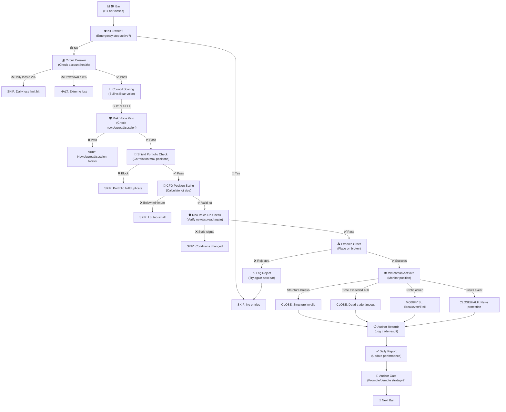

# AutoTrade System Workflow — การไหลของการตัดสินใจการเทรด

## ภาพรวม (Overview)

ระบบเทรดนี้ถูกออกแบบเป็น **pipeline ของ "บท​บาท"​ (roles)** ที่แตกต่างกัน เมื่อ​สัญญาณเทรดถูกสร้าง​ขึ้น มันจะ​ผ่าน​ไปทีละ​บท​บาท ​ตั้ง​แต่​การ​ประเมิน​กำลัง​ตลาด จนกว่า​ถึง​การ​ปิด​ฉัน​ (position) ​และ​การ​บันทึก​ผล​ลัพธ์

**5 บท​บาท​หลัก:**
1. **Council** (The Brain) — ประเมิน​สัญญาณ​การ​ซื้อ/ขาย​และ​ตรวจ​จับ​ความ​เสี่ยง​ด้าน​ราคา​และ​เวลา
2. **Risk Voice** — ประตูการ​ป้องกัน​ด้าน​ข้าง​ของ Council — ปฏิเสธ​ถ้า​ข่าว​เกิด​ขึ้นหรือ spread กว้าง​เกินไป
3. **Shield** — ตรวจ​สอบ​ความ​สม​ดุล​ของ​พอร์ต​ฟอ​ลิโอ — ยกเลิก​ถ้า​สัญญาณ​ซ้ำ​หรือ​ความ​เสี่ยง​เกิน
4. **CFO** — คำนวณ​ขนาด​ตำแหน่ง​ให้​พอ​เหมาะ​กับ​อำนาจ​การ​ซื้อ​และ​อัตรา​ความ​เสี่ยง
5. **Watchman** — จัดการ​ตำแหน่ง​ที่​เปิด​อยู่ — ล็อก​กำไร​หรือ​ปิด​เมื่อ​โครงสร้าง​พัง
6. **Auditor** — บันทึก​ผล​ลัพธ์​ประจำ​วัน​และ​ตัดสินใจ​ว่า​กลยุทธ์​พร้อม​สำหรับ​เงิน​จริง​หรือ​ไม่

---

## Workflow Diagram — แผนผังการไหลของข้อมูล



---

## 1. Council (ประเมิน​สัญญาณ) — The Brain

### หน้าที่
Council มี 3 "เสียง" (voices) ที่ให้คะแนนสัญญาณเทรดแต่ละครั้ง:
- **Bull Voice** — มองหาเหตุผลการซื้อ (ขึ้นต้นไป)
- **Bear Voice** — มองหาเหตุผลการขาย (ลงต้นไป)
- **ผลลัพธ์** — ถ้า Bull ≥70 และ Bear <40 = สัญญาณซื้อ | ถ้า Bear ≥70 และ Bull <40 = สัญญาณขาย | ถ้าทั้งสองสูง (≥55) = ขัดแย้ง → ไม่เทรด

เมื่อสัญญาณผ่าน Council แล้ว ระบบจะคำนวณ **Stop Loss (SL)** และ **Take Profit (TP)** ตั้งแต่ตรงนี้เลย:
- Stop Loss = ตำแหน่งที่ยอมให้ขาดทุน​ได้ (วางต่ำกว่าจุดต่ำสุดหรือสูงกว่าจุดสูงสุดของโครงสร้าง)
- Take Profit = จุดเป้าหมายกำไรที่คาดหวัง (โดยปกติ = 2 × Stop Loss distance)

### เงื่อนไข/Threshold ปัจจุบัน (ค่าจาก config/base.yaml)

| Parameter | ค่าปัจจุบัน | ความหมาย |
|-----------|---------|---------|
| `bull_threshold` | 70 | Score ที่ต้องถึงเพื่อถือว่า BUY มีแรง |
| `bear_threshold` | 70 | Score ที่ต้องถึงเพื่อถือว่า SELL มีแรง |
| `conflict_threshold` | 55 | ถ้าทั้งสองข้าง ≥ 55 ถือว่าขัดแย้งกัน → NO TRADE |
| `sl_buffer_atr` | 0.2 | ระยะ buffer เพิ่มเติมจากจุดสูงสุด/ต่ำสุด (หน่วย ATR) — ATR = Average True Range = ตัวชี้วัดความผันผวน |
| `sl_min_atr` | 0.8 | Stop Loss ต้องกว้างอย่างน้อย 0.8× ATR (เพื่อไม่โดน "noise" ที่ไร้ความหมาย) |
| `sl_max_atr` | 2.5 | Stop Loss ห้ามกว้างเกิน 2.5× ATR (เพื่อไม่เสี่ยงมากเกินไป) |
| `tp_r_multiple` | 2.0 | Take Profit = 2.0 × (Entry − SL) = เป้าหมายเป็น "2 R" (2 เท่าของการเสี่ยง) |

### ที่มา/ประวัติการปรับจูน
- **EXP-002** (2026-07-21): ทดสอบ `tp_r_multiple` 1.5–3.0 → **REJECTED ทั้งหมด**, ค่า 2.0 ยังคงดีที่สุด (แข็งแรง​ทุก​ปี)
- **EXP-009** (2026-07-22): ทดสอบ tp ใหม่ด้วย Watchman modeling → **REJECTED อีกครั้ง** (ยืนยัน 2.0 ยังเป็นตัวเลือกที่ดีที่สุด)

---

## 2. Risk Voice — ประตูป้องกัน (Council's Veto Gate)

### หน้าที่
Risk Voice คือ "ประตูรักษาความปลอดภัย" ของ Council — แม้สัญญาณจะดูดี แต่อาจ**ไม่ใช่เวลาที่เหมาะสม**ในขณะนี้:
- ข่าว​เศรษฐกิจ​ที่​สำคัญ​กำลัง​มา​ (เสี่ยงราคา​กระเบิด​ได้)
- Spread กว้างมากกว่าปกติ (transaction cost สูงเกินไป)
- นอกเวลาเทรดที่เหมาะสม (เช่น เวลา Asia ที่ซื้อขายน้อย หรือใกล้ปิดวันศุกร์)
- Market volatility ผิดปกติ (ATR > 3× average)

**ที่ทำไมสำคัญ:** ถ้าคุณเปิดตำแหน่งต้องตั้ง Stop Loss กว้าง​เพราะ​ข่าว​อพยพได้ มันก็ขัดแย้ง​กับ​ Risk Voice's job ​— เลย​จึง​ปฏิเสธ​ไป

### เงื่อนไข/Threshold ปัจจุบัน

| Parameter | ค่าปัจจุบัน | ความหมาย |
|-----------|---------|---------|
| `max_spread_multiple` | 1.5 | Spread ปัจจุบัน​ห้าม​เกิน 1.5× spread เฉลี่ย 20 วัน (spread = ส่วนต่างระหว่างราคาซื้อ-ขาย) |
| `max_spread_points_xauusd` | 35 | สำหรับ XAUUSD: Spread ห้ามเกิน 35 points (hardcoded limit) |
| `news_blackout_before_min` | 45 | ห้ามเปิดไม้ 45 นาที **ก่อน** news สำคัญ |
| `news_blackout_after_min` | 30 | ห้ามเปิดไม้ 30 นาที **หลัง** news สำคัญ |
| `max_stop_atr_multiple` | 2.5 | Stop Loss ที่คำนวณได้ต้อง ≤ 2.5× ATR (ควรจะแน่น หรือเสี่ยงมากขึ้นไปยัง Shield) |
| `session_start_hour` | 0 | เริ่มเทรดตั้งแต่ชั่วโมงนี้ (server time) |
| `session_end_hour` | 24 | เลิกเทรดหลัง​ชั่วโมง​นี้ (server time) — ช่วง [0,24) = ตลอด​24​ชั่วโมง​ |
| `friday_close_hour` | 20 | วันศุกร์​ห้าม​เปิด​ไม้​ใหม่หลัง​ 20:00 (เพื่อไม่กลัวช่วง​ weekend gap) |
| `max_atr_panic_multiple` | 3.0 | ATR > 3× average = market panic → veto ทุกไม้ |

### ที่มา/ประวัติการปรับจูน
- **EXP-003** (2026-07-21): ทดสอบ session gate [14,18) vs all-24h
  - **ผลลัพธ์:** all-24h ชนะใน 4 ของ 5 ปี → **ADOPTED** เปลี่ยน `session_start_hour=0, session_end_hour=24` ✅ **LIVE NOW**
  - เหตุผล: [14,18) ปิด London+NY overlap เท่านั้น แต่มันปิดเวลา profitable อื่นๆ เช่น Asia session บางครั้งก็ดี
  
- **EXP-004** (2026-07-21): ทดสอบ compromise [0,22) (ไม่รวม rollover 22-23)
  - **ผลลัพธ์:** ไม่ดีกว่า all-24h → **REJECTED** เหตุผล: "hours 22-23 losses" เป็น artifact ของ multi-year aggregate ไม่ใช่ per-year pattern

---

## 3. Shield — Portfolio Checkpoint (พอร์ต​เสรจ​ก่อน​ยิง)

### หน้าที่
Shield ตรวจสอบว่า **"ไม่ใช่​แค่​สัญญาณ​ดี​เท่านั้น​ แต่​ตำแหน่ง​ใหม่​นี้​จะ​ไม่​ทำให้​พอร์ต​ไม่​สมดุล​หรือ​เหลี่ยม​ความ​เสี่ยง​เกิน​ไป"**:
- **Reward:Risk ratio** — กำไรที่คาดหวัง / การขาดทุนที่เสี่ยง ต้อง ≥ 1.5 (ไม่ล่ะเอียดมากเกินไป)
- **Correlation guard** — ถ้า​มี​ตำแหน่ง​อื่น​ที่​ขยับ​ไป​ทางเดียวกันอยู่แล้ว​ และ​correlation > 0.7 → ปฏิเสธ (หลีกเลี่ยงเหลี่ยม correlation = ความสัมพันธ์ระหว่างราคา)
- **Max positions** — ห้ามเปิดตำแหน่งมากกว่า 3 พร้อมกัน (ไม่เสี่ยงเกินไป)
- **Duplicate cooldown** — ไม่ให้เปิดตำแหน่งเดิม​ในสัญญาณซ้ำเร็ว​เกินไป (ต้องห่าง 4 ชั่วโมง หรือ swing point ใหม่เกิด)

### เงื่อนไข/Threshold ปัจจุบัน

| Parameter | ค่าปัจจุบัน | ความหมาย |
|-----------|---------|---------|
| `min_rr` | 1.5 | Reward:Risk ขั้นต่ำ = TA ต้อง ≥ 1.5 (Reward ต้องเสี่ยง​ 1 เพื่อ​กำไร​ 1.5) |
| `max_correlation` | 0.7 | สัญญาณใหม่​ห้าม​ correlate > 0.7 กับตำแหน่ง​ที่เปิด​อยู่ (สหสัมพันธ์ = ความสัมพันธ์) |
| `max_positions_per_symbol` | 1 | สูงสุด 1 ตำแหน่ง​ต่อ​สัญญาณ (XAUUSD ได้ 1 ตำแหน่งพอ) — อนุมัติให้เพิ่มเป็น 2 หลัง live 3 เดือน |
| `max_positions_total` | 3 | สูงสุด 3 ตำแหน่ง​พร้อมกัน​ทั้ง​พอร์ต​ (ลดความ​เสี่ยง) |
| `total_risk_ceiling_pct` | 3.0 | ผลรวม​ risk​ ของ​ทุก​ตำแหน่ง​ ≤ 3.0% ของ account (ปลอดภัย​เพราะ​ถึง​ 3 เท่า​ trade​ แล้ว) |
| `duplicate_signal_cooldown_hours` | 4.0 | หลัง​ปิด​ตำแหน่ง​เดิม​​ ห้าม​เปิด​สัญญาณ​เดิม​​ใน 4 ชั่วโมง |

### ที่มา/ประวัติ
- ปกติใช้งาน (ไม่มี experiment ที่เปลี่ยน)

---

## 4. CFO — Money Manager (คำนวณขนาดไม้)

### หน้าที่
CFO คำนวณ **"ควรเสี่ยงเงินเท่าไหร่ในไม้นี้"** โดยพิจารณา:
- Account equity ปัจจุบัน
- Stop Loss ที่ wide/narrow แค่ไหน
- Broker minimum lot size (ห้ามน้อยเกินไป)
- Volatility ปัจจุบัน (ถ้า ATR สูง ให้ลดขนาด)

**สูตรพื้นฐาน:**
```
risk_amount = equity × risk_per_trade_pct
stop_distance = entry - stop_loss (in points)
lot_size = risk_amount / (stop_distance × point_value)
```

ผลหลัก: ไม่ว่าไม้ไหน ก็เสี่ยงเงินจำนวน​เดียวกัน​เสมอ

### เงื่อนไข/Threshold ปัจจุบัน

| Parameter | ค่าปัจจุบัน | ความหมาย |
|-----------|---------|---------|
| `risk_per_trade_pct` | 1.0 | เสี่ยง 1.0% ของ account ต่อไม้ |
| `daily_loss_limit_pct` | 2.0 | ขาดทุนสะสมวันนี้ ≥ 2% → หยุดเทรด (circuit breaker) |
| `max_consecutive_losses` | 3 | แพ้ 3 ไม้ติดกัน → หยุด 24 ชั่วโมง |
| `max_drawdown_halt_pct` | 8.0 | Drawdown (ขาดทุนสูงสุดจาก peak) ≥ 8% → **ระบบหยุด​** ต้อง restart ด้วยมือ |
| `min_lot_risk_cap_pct` | **1.5** | ถ้า lot ที่คำนวณได้ต่ำกว่าขั้นต่ำ broker (0.01) แต่เทรด 0.01 lot จะเสี่ยงไม่เกิน 1.5% ของ equity → เทรด 0.01 lot แทนการข้ามสัญญาณ (default ของโค้ดคือ `None`/ปิด — นี่คือทางเลือกที่ตั้งใจเปิดใช้กับบัญชีเล็ก ไม่ใช่พฤติกรรมมาตรฐานตามสเปค §3.1) |

### ที่มา/ประวัติการปรับจูน
- **ADOPTED (2026-07-22)**: ปรับจาก 0.5% → **1.0%** แล้ว (`config/base.yaml` ปัจจุบัน) หลังจากเจอเหตุการณ์จริงที่สัญญาณ Council ผ่านทุกด่านแล้วถูกทิ้งเพราะคำนวณ lot ได้ต่ำกว่าขั้นต่ำของ broker (0.01 lot) — การวัดผล (บันทึกใน experiments_log.md เป็น informational note ไม่ใช่ EXP-### เพราะเป็นแค่การวัดผลกระทบของ position-sizing ไม่ใช่การหา edge ใหม่) พบว่าที่ 0.5% สัญญาณที่ผ่านทุกด่านถูกทิ้งไปถึง ~72% เพราะบัญชี demo $3,000 เล็กเกินไปเทียบกับ stop distance ของทองคำ ที่ 1.0% อัตราการถูกทิ้งลดลงเหลือ ~52% (**ตัวเลขนี้วัดตอน `breakeven_enabled`/`trail_enabled` ยังเป็น `true` — ล้าสมัยแล้ว**) การวัดผลเดียวกันนี้ยัง flag ไว้ว่าการเพิ่มเงินฝากในบัญชี demo (เช่น $10,000) จะแก้ปัญหานี้ได้ตรงจุดกว่าการดัน risk% ขึ้นอีก — แต่ผู้ใช้ยืนยันปรัชญาโปรเจกต์ว่าห้ามใช้ทางแก้นี้ ต้องใช้งานได้จริงบนบัญชีเล็ก
- **Re-measured (2026-07-22, หลัง EXP-008 adopted):** ที่ risk 1.0% + be/trail ปิดแล้ว อัตราการถูกทิ้งจริงตอนนี้คือ **~31.6%** (ต่ำกว่าตัวเลขเดิมมาก เพราะปิด be/trail ทำให้ถือไม้นานขึ้นถึง 2R เป้าหมาย แท่งที่ว่างสำหรับสัญญาณใหม่จึงน้อยลง) — ยังถือว่าสูงอยู่ นำไปสู่การทดสอบ **min-lot risk-cap fallback** (ดูรายละเอียดเต็มใน `experiments/experiments_log.md`'s NOTE ล่าสุด และหัวข้อประวัติการปรับจูนด้านล่าง)
- **ADOPTED (2026-07-22, Stage 2 decision) — `min_lot_risk_cap_pct: 1.5`:** เพิ่ม fallback ที่เบี่ยงเบนจากสเปค §3.1 ("อย่าฝืนเสี่ยงเกินแผน") แบบตั้งใจและเปิด/ปิดได้ด้วย config (`risk/sizing.py::compute_lot_size`'s default ในโค้ดยังเป็น `None`/ปิดเสมอ — `config/base.yaml` เป็นจุดเดียวที่ตั้งใจเปิดใช้จริง). Stage 1 measurement (`experiments/experiments_log.md`'s NOTE วันเดียวกัน "small-account sizing REFRESH + min-lot-fallback measurement", full history 2021–2026 ~29,500 H1 bars) พบว่าที่ risk=1.0% ยังมีสัญญาณ ~31.6% ถูกทิ้งเพราะ lot ต่ำกว่าขั้นต่ำ broker — เปิด fallback ที่ cap=1.5% กู้สัญญาณกลับมาได้ 63 ไม้ (จากทั้งหมด 1257 ไม้ในช่วงทดสอบ), PF รวมขยับจาก 1.0496 → 1.1244, net$ จาก $1049 → $2808 และที่สำคัญคือ **ไม้ที่กู้กลับมาเองมี PF 1.60 แยกต่างหาก** ไม่ใช่ไม้ขยะ แม้ maxSingleLoss ต่อไม้จะขยับขึ้นได้ถึง ~3.5% ของ equity (เดิม ~1.9% ที่ risk 1.0% ปกติ) เมื่อ fallback ทำงานจริง — trade-off นี้ถูกยอมรับอย่างมีข้อมูลรองรับ ไม่ใช่การเดา

---

## 5. Watchman — Position Monitor (ดูแลตำแหน่ง​ที่​เปิด​อยู่)

### หน้าที่
เมื่อ​ตำแหน่ง​เปิด​ไป​แล้ว Watchman จะ​ทำงาน​ต่อ​เนื่อง​ทุก​bar/tick เพื่อ:
- **Lock in profits** — เมื่อ​กำไร​ถึง​ 1.0R → ย้าย SL ไปที่ entry (break-even = ไม่ขาดทุน)
- **Trail the stop** — เมื่อ​กำไร​ > 1.5R → ทำให้ SL ตาม​ราคา​ขึ้น​ (ATR-based trailing = ทำตามราคาสูงสุดใหม่)
- **Detect structure breaks** — ถ้า​ราคา​พัง​โครงสร้าง​ที่​ใช้​สร้าง​สัญญาณ​ → **ปิด​ทันที** (ไม่รอ​ SL)
- **Time stop** — ไม้​ที่​​เปิด​เกิน​ 48 ชั่วโมง​แล้ว​ อยู่​ในช่วง​ dead-trade (±0.3R กำไร/ขาดทุน) → ปิด (ไม่ค้นไม่ยุ่ง)
- **News protection** — ข่าว​มา​ใน​ 30 นาที​ แล้ว​ไม้​กำไร​ ≥ 0.5R → ปิด​ครึ่ง​ + ย้าย​ SL​ break-even

### เงื่อนไข/Threshold ปัจจุบัน

| Parameter | ค่าปัจจุบัน | ความหมาย |
|-----------|---------|---------|
| `breakeven_at_r` | 1.0 | ย้าย​ SL​ break-even​ เมื่อ​ profit​ ≥ 1.0R (เสี่ยง​ 1 ได้​กำไร​ 1) |
| `trail_start_r` | 1.5 | เริ่ม ATR-trail เมื่อ profit ≥ 1.5R |
| `trail_distance_atr` | 1.0 | Trailing stop วาง​ ห่าง​ 1.0× ATR จากสูง​สุด​ล่าสุด (ให้​เคลื่อน​ไหว​ได้​) |
| `time_stop_hours` | 48 | Dead-trade timeout = 48 ชั่วโมง |
| `dead_trade_r_band` | 0.3 | Dead-trade = profit/loss อยู่ระหว่าง ±0.3R |
| `news_window_minutes` | 30 | ป้องกัน news ก่อน 30 นาที |
| `news_profit_threshold_r` | 0.5 | ปิด​ครึ่ง​ถ้า​ news​ + profit​ ≥ 0.5R |
| `connectivity_timeout_minutes` | 5 | ขาด​ connection​ MT5​ > 5​ นาที​ → alert |
| `breakeven_enabled` | **false** | เปิด/ปิดกลไก breakeven — ปิดอยู่ (ADOPTED 2026-07-22 หลัง joint verification) |
| `trail_enabled` | **false** | เปิด/ปิดกลไก ATR-trailing — ปิดอยู่ (ADOPTED 2026-07-22 หลัง joint verification) |

### ที่มา/ประวัติการปรับจูน — **สำคัญมาก**

- **EXP-006** (2026-07-21): ทดสอบ​ Watchman​ params​ ทั้งหมด
  - **ผลลัพธ์:** Watchman​ ด้วย​ค่า​ default​ ทำให้​กำไร​ **ลด​ลง** ใน​ backtest (3 ของ 5 ปี net-negative)
  - **เหตุผล:** breakeven(1.0) + trail(1.5) ทั้งสอง​ < tp(2.0) → ปิด​ตำแหน่ง​ก่อน​ถึง​ 2R target

- **EXP-008** (2026-07-22): วิเคราะห์​กลไก​ Watchman​ = mechanism isolation
  - **ผลลัพธ์:** 
    - **breakeven+trailing** = net-harmful (−$1,535) → ปิดกลไกนี้ ✅ **Test-confirmed**
    - **structure-invalidation** = net-beneficial (+$392) → KEEP
    - **time-stop** = neutral-to-slightly-negative → KEEP (มีค่า live protection)
  - **วิธีปิด:** EXP-008 เสนอไว้แบบ sentinel (`breakeven_at_r: 999`) เป็นทางลัด แต่ทีมเลือกวิธีที่สะอาดกว่าคือเพิ่ม boolean flag ตรงๆ — `watchman.breakeven_enabled`/`watchman.trail_enabled`
  - **ผลลัพธ์ Test (ก่อน joint verify)**: PF 1.215 → 1.304 (+$387 net) ✅ ผ่านเกณฑ์ promotion gate (PF≥1.3)

- **Joint re-verification** (2026-07-22, ทำ 3 วิธีอิสระเพื่อตัด sizing-floor confound: risk-based sizing ที่ equity $50,000 และ $10,000, กับ fixed-lot 0.1 ที่ equity จริง $3,000):
  - ทั้ง 3 วิธี**เห็นตรงกัน**ว่า "ปิด breakeven/trail อย่างเดียว (คง pivot_bars=3)" ดีที่สุด — เช่นที่ equity $50,000: PF 1.18→**1.24**, net $13,357→**$17,060**
  - "ทำทั้งคู่พร้อมกัน" (ปิด be/trail **และ** เปลี่ยน pivot_bars=4) **ไม่เคยดีกว่า** ปิด be/trail อย่างเดียวเลยสักวิธี — สรุปว่า pivot_bars=4 (EXP-009) ถูกจูนไว้ตอน Watchman ยังพังอยู่ ไม่ได้เพิ่มคุณค่าอะไรอีกหลัง Watchman ถูกแก้แล้ว

**สรุป Watchman:**
- **ปัจจุบัน (live): `breakeven_enabled: false`, `trail_enabled: false`** ✅ **ADOPTED 2026-07-22** — structure-invalidation และ time-stop ยังทำงานตามปกติ
- **pivot_bars ยังคงอยู่ที่ 3** — EXP-009's candidate (4) ถูก supersede ไม่ใช่แค่เลื่อนออกไป

---

## 6. Auditor — Performance Reviewer (บันทึกและประเมินผล)

### หน้าที่
ทุก​สิ้น​วัน Auditor บันทึก​:
- จำนวน​ไม้​ที่​ trade / profit / loss / net P&L
- Profit Factor = (gross profit) / (gross loss) — ค่า >1.0 = กำไรโดยรวม
- ค่า​เฉลี่ย R (expectancy) = กำไร​เฉลี่ย​ต่อ​ไม้​ในหน่วย​ R (R = risk size)
- Signal blocks = ที่ block​ ด้วย​ Council​ / Risk Voice / Shield

ก่อนสำคัญ: **ตัด​สินใจ​ว่า​กลยุทธ์​พร้อม​สำหรับ​ไม้​ใหม่​หรือ​ยัง** — Auditor gate​

### Promotion Gates (ขั้นบันได​เลื่อนระดับ)

| เลื่อนจาก | เลื่อนไป | เกณฑ์ |
|---------|--------|-------|
| Backtest | Paper | **out-of-sample**: PF ≥ 1.3, DD ≤ 15%, ≥ 200 trades (รวม cost model) |
| Paper | Live Ramp | ≥ 100 trades OR ≥ 16 weeks, PF ≥ 1.2, DD ≤ 12%, paper ไม่ต่างจาก backtest >30% |
| Live Ramp | Full Size | ≥ 3 เดือน at 0.25%, PF ≥ 1.2, no extreme CB trigger, slippage ≠ kill expectancy |

### ที่มา/ประวัติ
- ยังไม่มี experiment ไม่ได้เปลี่ยนค่า audit gate (rule 8: gate thresholds NOT touched)

---

## 7. สรุปการเปลี่ยนแปลงล่าสุด (Recent Changes) — Session 2026-07-21/22

ล​​ำดับ​ (**ใหญ่ไป​เล็ก โดย​ impact​**):

### ✅ ADOPTED (Live Now)

1. **Session gate removed** — EXP-003 confirmed
   - **เปลี่ยนจาก:** `session_start_hour: 14, session_end_hour: 18` (London+NY overlap only)
   - **เปลี่ยนไป:** `session_start_hour: 0, session_end_hour: 24` (all-24h)
   - **เหตุผล:** All-24h ชนะใน 4/5 ปี incl. Test year; filter [14,18) ตัดสัญญาณ profitable จาก Asia บางครั้ง
   - **สถานะ:** ✅ **LIVE** — config/base.yaml updated

2. **Watchman breakeven + trailing disabled, structure-invalidation/time-stop KEPT** — EXP-008 + joint re-verification
   - **เปลี่ยน:** `watchman.breakeven_enabled: false`, `watchman.trail_enabled: false` (boolean gate ใหม่ แทนวิธี sentinel ตัวเลขที่ EXP-008 เสนอไว้ตอนแรก)
   - **เหตุผล:** breakeven+trail ทำให้ ปิด winners ก่อนถึง 2R target; disabling เพิ่ม PF 1.215 → 1.304 on Test (ก่อน joint verify) และยืนยันอีกครั้งด้วย 3 วิธีอิสระที่ตัด sizing-floor confound ออก (equity $50,000/$10,000 + fixed-lot ที่ equity จริง)
   - **สถานะ:** ✅ **LIVE** — config/base.yaml updated, shadow loop restarted (2026-07-22)

### ❌ REJECTED / SUPERSEDED (Tested, Didn't Pan Out)

3. **pivot_bars = 4** — EXP-009 Test-confirmed, then SUPERSEDED by joint re-verification
   - **ทดสอบเดิม (EXP-009):** hardcoded 3 → 4 (6 bars lookback = fractal 4-4) ดูเหมือนดีกว่า (Test PF 1.243 vs 1.215) — แต่วัดตอน Watchman ยังใช้ค่า default ที่รู้แล้วว่าพัง
   - **Joint re-verification (2026-07-22):** ทดสอบ "ปิด be/trail อย่างเดียว" กับ "ปิด be/trail + เปลี่ยน pivot=4 พร้อมกัน" ด้วย 3 วิธีที่ตัด sizing confound (equity $50,000, $10,000, fixed-lot 0.1 ที่ equity จริง) — **ทั้ง 3 วิธีเห็นตรงกันว่า pivot=4 ไม่เพิ่มคุณค่าอะไรอีกหลัง Watchman ถูกแก้แล้ว** (การทำทั้งคู่พร้อมกัน แย่กว่าหรือเท่ากับปิด be/trail อย่างเดียวเสมอ)
   - **สถานะ:** ❌ ไม่ adopt — `global.swing_pivot_bars` ยังคงอยู่ที่ 3 (ช่อง config พร้อมใช้แล้วถ้าจะมีหลักฐานใหม่ในอนาคต)

4. **TP R-multiple variants** — EXP-002, EXP-009
   - **ทดสอบ:** tp ∈ {1.5, 1.75, 2.0, 2.25, 2.5}
   - **ผลลัพธ์:** REJECT 1.5/1.75 (net-negative), REJECT 2.25/2.5 (fail Y1 2021-22 regime)
   - **สถานะ:** ❌ tp=2.0 stands; no change

5. **M15 lower-timeframe entry confirmation** — EXP-005
   - **ทดสอบ:** 8 M15 intraday features → discriminate winners?
   - **ผลลัพธ์:** 7/8 flip sign OOS; 1 is median artifact → NO robust edge
   - **สถานะ:** ❌ REJECTED; M15 exits deferred behind H1 Watchman modeling

6. **M30 lower-timeframe entry confirmation** — EXP-007
   - **ทดสอบ:** 8 M30 intraday features (coarser than M15)
   - **ผลลัพธ์:** Same rejection as M15; 3/8 crude sign-flip, 5 pass binary but fail per-year/per-value coherence
   - **สถานะ:** ❌ REJECTED; REINFORCES M15 finding on stronger evidence (full Train coverage incl. 2021-22)

7. **Timeframe probe: H1 vs M30/M15/M5** — Probe (not EXP-###)
   - **ทดสอบ:** Apply current H1 rules on M30/M15/M5 → edge collapse
   - **ผลลัพธ์:** Full-history: **H1 PF 1.081** vs M30 1.007 / M15 1.001 (= breakeven, ตัด top-5 winners แล้วเหลือ ≤1.0); common window (ก.พ. 2025–ก.ค. 2026): H1 1.215 → M30 1.111 → M15 1.075 → M5 1.017 พร้อม DD บันได 11.5%→53.7% — monotone staircase ทุกมุมมอง; cost/R แย่ลงตาม TF (~1.7% H1 → ~6.7% M5)
   - **หมายเหตุ:** ตัวเลข probe รันก่อนแก้ spread floor + ก่อนรู้ว่า commission จริงเป็น 0 (ดู ADDENDUM ใน experiments_log.md) — verdict ยืน แต่ห้ามอ้างตัวเลขเป๊ะๆ ต่อ
   - **สถานะ:** ✅ **H1 CONFIRMED** as primary signal timeframe; lower TFs rejected; M5 rejected outright

8. **H1→M30 hybrid entry timing** — EXP-010 pre-registered
   - **ทดสอบ:** (NOT YET RUN) Keep H1 Council bias/veto, but enter on M30 pullback-then-resume trigger with M30-structure stop → tighter stop, better entry price, fewer sub-min-lot skips on $3k account
   - **Prerequisites:** (a) ~~spread-zero data fix~~ ✅ เคลียร์แล้ว 2026-07-22 (spread floor applied); (b) re-baseline H1/M30 ด้วยข้อมูลที่แก้แล้ว + commission 0 (ตัวเลข baseline ใน pre-registration เป็นค่าก่อนแก้ cost); (c) two-TF bridge harness ยังไม่ได้สร้าง
   - **สถานะ:** 🔄 **PRE-REGISTERED ONLY** — พร้อมเริ่มเมื่อ re-baseline + harness เสร็จ

### 🔄 INFRASTRUCTURE READY, AWAITING REAL-WORLD VERIFICATION

7. **Watchman exits modeled in backtest** — Commit 67df406
   - **Backtest engine** now simulates breakeven/trail/time-stop/structure-invalidation when `WatchmanConfig` passed
   - **Impact:** EXP-006+ first time these params have real backtest exposure
   - **สถานะ:** ✅ Code ready, pending parameter tuning outcomes (see point 2 above)

8. **Historical spread=0 floored (data-integrity fix, 2026-07-22)** — ⚠️ มี gotcha ประจำ
   - **ปัญหา:** MT5 ไม่ retro-populate spread ของ bars เก่า → `spread=0` ~50% ของไฟล์ H1 = backtest คิดต้นทุนต่ำเกินจริงมาตลอด
   - **แก้แล้ว:** แทนเฉพาะแถว `spread==0` (ค่าจริง 1–4 pts ไม่แตะ): XAUUSD ทุก TF → 5 pts, EURUSD → 10, GBPUSD → 13, USDJPY → 10 (ที่มาเต็มใน experiments_log.md NOTE "Historical `spread` zero-value floor")
   - **✅ แก้ถาวรแล้ว (commit `5be62c8`, 2026-07-22):** `feed/historical.py` ตอนนี้ floor spread==0 ให้อัตโนมัติทุกครั้งที่ download (per-symbol, ทุก TF, raise ดังๆ ถ้าเจอ symbol ที่ไม่รู้จัก) — download ใหม่ไม่ทำให้ zeros กลับมาอีกแล้ว ข้อยกเว้นเดียวที่ยังค้าง: GBPUSD/USDJPY ข้อมูล spread ที่*มีค่าอยู่แล้ว*ไม่น่าเชื่อถือ (1pt = 0.1 pip ไม่สมจริง) ต้อง re-download ก่อน FX go-live

---

## 8. ภาพรวมแผนที่​ค่าตัวแปร — Master Config Reference

```yaml
global:
  timeframe: H1
  timezone: server # MT5 server time

global:
  timeframe: H1
  timezone: server
  swing_pivot_bars: 3   # EXP-009's candidate (4) tested Test-confirmed but SUPERSEDED by the
                         # 2026-07-22 joint re-verification -- stays 3, see Watchman section

symbols:
  XAUUSD: XAUUSD   # only Gold; FX (EURUSD/GBPUSD/USDJPY) commented — failed OOS tests

council:
  bull_threshold: 70
  bear_threshold: 70
  conflict_threshold: 55

order:
  sl_buffer_atr: 0.2
  sl_min_atr: 0.8
  sl_max_atr: 2.5
  tp_r_multiple: 2.0

risk_voice:
  max_spread_multiple: 1.5
  max_spread_points_xauusd: 35
  news_blackout_before_min: 45
  news_blackout_after_min: 30
  max_stop_atr_multiple: 2.5
  session_start_hour: 0        # ← CHANGED (EXP-003)
  session_end_hour: 24         # ← CHANGED (EXP-003)
  friday_close_hour: 20
  max_atr_panic_multiple: 3.0

shield:
  min_rr: 1.5
  max_correlation: 0.7
  max_positions_per_symbol: 1   # future: 2 after 3 mo live
  max_positions_total: 3
  total_risk_ceiling_pct: 3.0
  duplicate_signal_cooldown_hours: 4.0

cfo:
  risk_per_trade_pct: 1.0      # ADOPTED 2026-07-22 (was 0.5) — see CFO section above
  daily_loss_limit_pct: 2.0
  max_consecutive_losses: 3
  max_drawdown_halt_pct: 8.0
  min_lot_risk_cap_pct: 1.5    # ADOPTED 2026-07-22 — see CFO section above

watchman:
  breakeven_at_r: 1.0
  trail_start_r: 1.5
  trail_distance_atr: 1.0
  time_stop_hours: 48
  dead_trade_r_band: 0.3
  news_window_minutes: 30
  news_profit_threshold_r: 0.5
  news_close_mode: half
  connectivity_timeout_minutes: 5
  breakeven_enabled: false     # ADOPTED 2026-07-22 (was true) -- EXP-008 + joint re-verification
  trail_enabled: false         # ADOPTED 2026-07-22 (was true) -- see Watchman section above

auditor:
  promotion: { ... }           # backtest 1.3/15%/200, paper 1.2/12%, live_ramp 1.2/3mo
  demotion: { ... }            # 2 losing months, 60d rolling PF<1.0, etc.
```

---

## 9. Glossary — คำศัพท์เทรดพื้นฐาน (สำหรับผู้อ่านที่ไม่เคยเทรดมาก่อน)

| คำศัพท์ | ความหมาย | ตัวอย่าง |
|--------|---------|---------|
| **Position / ไม้** | ตำแหน่งเทรดที่เปิดอยู่ (BUY หรือ SELL) | "เปิดไม้ BUY XAUUSD" |
| **Stop Loss (SL)** | ราคาที่เรากำหนด เพื่อปิดตำแหน่งโดยอัตโนมัติ ถ้าขาดทุนเกินไป | "เปิด​ BUY ที่ 2000, SL 1990" = ขาดทุนสูงสุด 10 points |
| **Take Profit (TP)** | ราคาที่เรากำหนด เพื่อปิดตำแหน่งโดยอัตโนมัติ เมื่อกำไรพอใจ | "TP 2020" = ปิดขาย เมื่อได้กำไร 20 points |
| **Spread** | ส่วนต่างระหว่างราคา Bid (ซื้อ) vs Ask (ขาย) — transaction cost | Bid 2000.5 / Ask 2000.8 = spread 0.3 points |
| **Profit Factor** | (รวม gross profit) / (รวม gross loss) — ต้อง >1.0 ถึงจะกำไร | PF 1.2 = ทำ $120 ได้เพราะ $100 หาย → net +$20 |
| **R / Risk size** | "R" = ขนาดความเสี่ยง = entry − stop loss | ถ้า entry 2000, SL 1990 → R=10 |
| **R-multiple / Reward** | กำไรที่ได้ / R — เช่น 2R = กำไร 2 เท่าของ R | TP 2020, R=10 → TP = 2R (ได้ 20 = 2×10) |
| **Average R / Avg R** | (รวม all P&L) / (จำนวน trades) / (ขนาด R เฉลี่ย) — expectancy per trade | avg R = 0.05 = เฉลี่ยทำได้ 0.05R / ไม้ |
| **Drawdown (DD)** | ขาดทุนสูงสุด จากยอดกำไร​ล่าสุด​ ไปจนถึงขั้นต่ำ​ในช่วงนั้น​ — เสี่ยงชั่วขณะ | เคยมีกำไร $1000, แล้วลดเหลือ $950 = DD 5% ($50) |
| **Volatility / ATR** | ความไม่แน่นอนของราคา — ATR = Average True Range = ตัวชี้วัด | ถ้า ATR=20 points = ราคา​ปกติ​หนลบ 20 ต่อ hour |
| **Correlation** | ความสัมพันธ์ระหว่างราคา​สอง​สัญญาณ — 0 = ไม่เกี่ยว, 1 = เคลื่อนไปทางเดียว | Gold vs Silver correlation 0.8 = มักขึ้นขึ้นลงลง​พร้อม |
| **Slippage** | ราคา fill ตัวจริง ต่างจาก order price ที่คาด — transaction friction | order ที่ 2000.0, fill ที่ 2000.5 = slippage 0.5 |
| **News Blackout** | ช่วงเวลา​ห้ามเทรด เนื่องจาก​ข่าว​เศรษฐกิจ​ใหญ่​กำลัง​มา | FED interest rate 45 นาที → ห้าม entry |
| **Session / เวลาเทรด** | ช่วงเวลา​ของ​การเทรด — London morning, NY afternoon, Asia night | Asia session = thin liquidity (ซื้อขายน้อย) |
| **Circuit Breaker** | กลไก​ปลอดภัย​อัตโนมัติ​ที่​หยุด​ระบบ​ เมื่อ​ขาดทุน​หรือ​ความเสี่ยง​เกิน​ | Daily loss ≥ 2% → ระบบ​ไม่​เปิด​ไม้​ใหม่​จนถึง​พรุ่งนี้ |
| **Break-even** | ย้าย SL ไปที่ entry price → ไม่​ขาดทุน​ถึงแม้​ราคา​​กลับ​ | entry 2000, SL 1990 → เมื่อ​กำไร​ 1R (ราคา​ 2010), ย้าย SL → 2000 |
| **Trailing Stop** | SL ที่​เคลื่อนตาม​ราคา​ขึ้นเรื่อยๆ​ เพื่อ​ล็อก​กำไร | ราคาสูงสุด 2050, ทราเล 1.0×ATR → SL ที่ 2030 (ตาม​ขึ้น​) |
| **Structure Invalidation** | ปิดตำแหน่ง​ เมื่อ​โครงสร้าง​ราคา​ที่​ใช้​สร้าง​สัญญาณ​พัง | BUY เพราะ higher low ยืนเหนือ swing low; ถ้า​ราคา​ลง​ล่าง​ swing low → โครงสร้าง​พัง​ → ปิด |
| **Lot size** | จำนวน units ที่​ trade — XAUUSD lot = 1 oz troy | 1.0 lot = 1 ounce gold ≈ $2000 (ราคาปัจจุบัน) |
| **Commission** | ค่า​ธรรมเนียม​โบรกเกอร์​ต่อ​ไม้ — depends on account type | IC Markets **Standard** = $0 commission (cost lives in spread); Raw Spread = $7/lot (2 ways: open + close = $14/trade) |

---

## 10. ขั้นตอนปกติ (Normal Trade Flow) — Step by Step

1. **H1 bar ปิด** → ระบบ​ประเมิน​สัญญาณ
2. **Council** — Bull/Bear scoring; ถ้าผ่านไป order plan (entry/SL/TP) คำนวณแล้ว
3. **Risk Voice** — ตรวจ news, spread, session → pass?
4. **Shield** — Correlation, max positions, duplicate cooldown → pass?
5. **CFO** — Compute lot size from equity + SL distance → ≥ broker min?
6. **Risk Voice re-check** — ข้าว/spread ยังเหมือน​ไหม
7. **Execute** — yank order ไป broker
8. **Watchman starts** — ล​จดสัญญาณ, ทำให้ track position
9. **Bar ถัดไป...** — Watchman check structure/time/profit continuously
10. **Position close** → Auditor log; daily report; check promotion/demotion gates

---

**Document Date:** 2026-07-22  
**Config Version:** `config/base.yaml` (post-EXP-003 session-gate change, post-EXP-008 Watchman breakeven/trail adoption, min-lot-risk-cap-pct: 1.5 adopted, Standard account cost model)  
**Last Major Change:** EXP-008 ADOPTED 2026-07-22 (`watchman.breakeven_enabled`/`trail_enabled: false`, live restarted); min-lot fallback adopted (cfo.min_lot_risk_cap_pct: 1.5); Account type confirmed **Standard** (ZERO commission); Timeframe probe H1-confirmed (M30/M15/M5 rejected); EXP-010 pre-registered (H1→M30 hybrid entry timing — spread fix เคลียร์แล้ว รอ re-baseline + harness)
